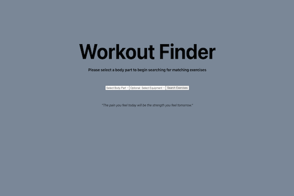

<!--
Things to do:
2. Add GIFs
-->

# Phase 1 Project: Workout Finder

## Introduction

Have you ever gotten sick of your normal workout routine at the gym? If you are like me and don't know all of the different types of exercises, going to the gym can turn into a monotonous chore. Workout Finder is a simple web application that lets the user select a body part to search for all matching exercises from a database of over 1300 exercises. If needed, the user can refine the search by selecting an equipment they want to incorporate into the exercise.

## Description

Workout Finder uses db.json in the local repository. The original database is cited below in the Authors and Acknowledgement section.

### Searching Exercises

There are two drop down menus: one for the body part and the other for the equipment. By default, the equipment is set to no preference.

The user selects a body part and equipment to search for all potential exercises.

### Favoriting Exercises

The user can favorite an exercise by clicking on the star next to the name. This brings the exercise to the top of the list in alphabetical order. Clicking on a favorited exercise unfavorites it and brings it back to the original list. Favoriting exercises is persisted.

### Adding Notes

Each exercise has a details button that reveals a GIF of the exercise, the target muscle being worked and a form to add a note.

To add a note, the user clicks on the details button, types into the form and clicks save. The user can delete a note by clicking on the delete button next to the note.

Only one note is allowed per exercise. Any additional notes will replace the previous one. The notes are persisted.

## Support

Please contact me at jjpark987@gmail.com for any questions.

## Authors and Acknowledgment

The original database used for this project is ExerciseDB by Justin Mozley. Link is provided below:
https://rapidapi.com/justin-WFnsXH_t6/api/exercisedb/details